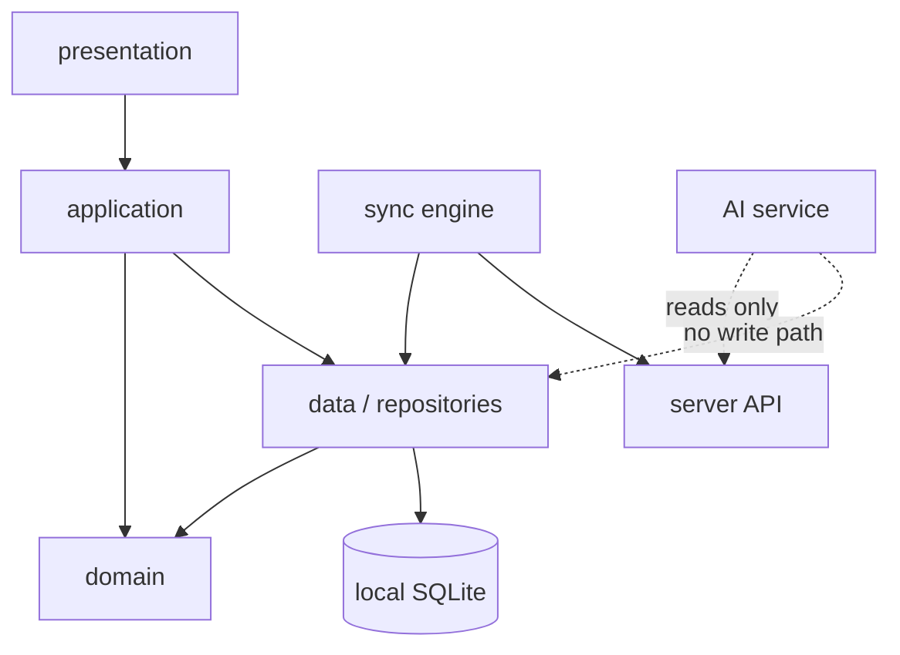
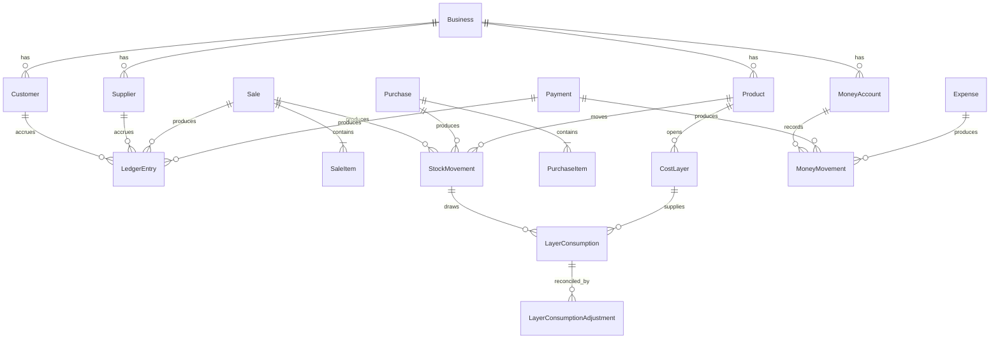
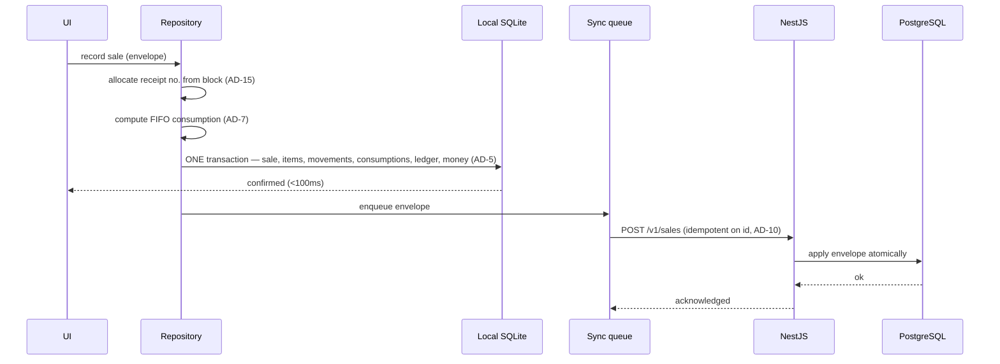
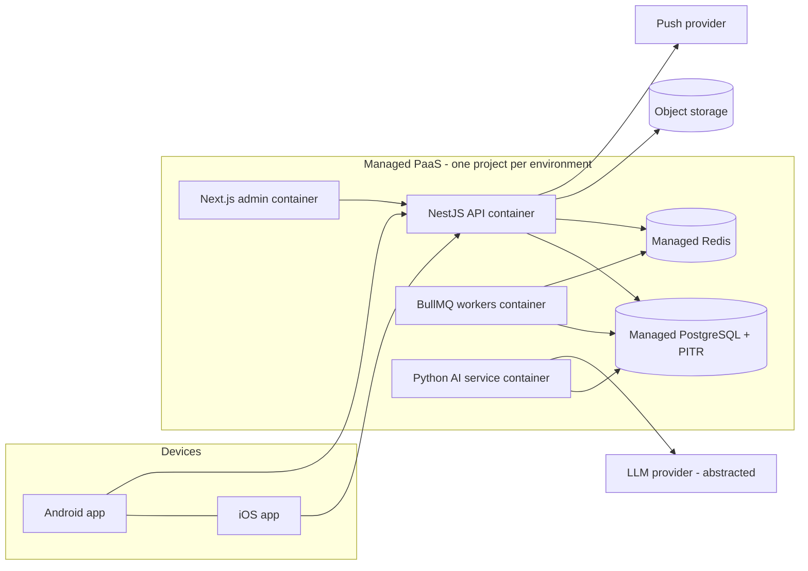

# Architecture Spine — Hisab

## Design Paradigm

**Local-first append-only ledger over a modular monolith.**

The device owns the write. Every transaction is created, validated and committed against the local SQLite store first; the server is a durable replica and the authority only for identity, entitlements and reference-data conflict resolution. This is what makes FR-93 (record everything offline) a property of the architecture rather than a feature bolted onto one.

Financial data is **append-only**. Nothing that has money in it is ever updated or deleted — corrections are reversals, and a balance is the sum of its entries. That single choice removes most of the distributed-systems problem: append-only records from two devices cannot conflict, they merge.

Layer mapping:

| Layer | Client (Flutter) | Server (NestJS) |
| --- | --- | --- |
| Presentation | `lib/features/<feature>/presentation` | `src/modules/<module>/*.controller.ts` |
| Application | `lib/features/<feature>/application` | `src/modules/<module>/*.service.ts` |
| Domain | `lib/features/<feature>/domain` | `src/modules/<module>/domain` |
| Data | `lib/features/<feature>/data` + `lib/core/db` | `src/modules/<module>/*.repository.ts` |

## Invariants & Rules



Dependency direction is one-way inward: presentation never touches data, domain depends on nothing, and the sync engine is the only component that talks to the server.

### AD-1 — Money is integer minor units

- **Binds:** all
- **Prevents:** Dart, TypeScript and Postgres each choosing a numeric type, and float arithmetic drifting a ledger by a paisa that never reconciles.
- **Rule:** Every monetary value is an integer count of **paisa** (1 BDT = 100 paisa). `BIGINT` in Postgres, `int` in Dart, `bigint` in TypeScript, JSON number. No float, no decimal library, no string-encoded money, anywhere, in any tier. **Storage only — the owner never sees a paisa.** Every user-facing surface renders taka: ৳1,080, stored as `108000`. Formatting happens at the display edge and nowhere else, and input parses the other way. Nothing in the UI, a receipt, a report or an export is denominated in paisa. Division (FIFO layer splits, percentage discounts) rounds half-to-even, and the residual paisa is assigned to the last consumed layer or last line so the parts always re-sum to the whole.

### AD-2 — Quantity is integer milli-units

- **Binds:** all inventory, sale and purchase lines
- **Prevents:** decimal quantities re-introducing the float problem AD-1 removed, and two modules disagreeing on precision.
- **Rule:** Quantity is an integer count of **thousandths** of the product's Unit — 2.5 kg is stored as `2500`. `BIGINT`/`int`. **Storage only:** the owner types and reads *2.5 কেজি*; grams and milli-units never appear on a screen, a receipt or an export. The Unit type decides whether the UI accepts a fraction at all: Piece, Box, Packet and Dozen are whole-only; Kg, Gram, Liter and Meter accept up to three decimals.

### AD-3 — Client-minted UUIDv7 is the only identity [ADOPTED]

- **Binds:** every synced entity
- **Prevents:** offline foreign keys pointing at local ids that must be rewritten on sync — the standard source of orphaned children and double-posted transactions.
- **Rule:** The device mints a UUIDv7 at creation; it is the primary key on the device and on the server, forever, and it is what every foreign key stores. **TD §13's `serverId` is removed** — there is exactly one identity per record. Server-side sequences exist only for human-facing references (AD-15).

### AD-4 — Financial records are append-only [ADOPTED]

- **Binds:** Sale, SaleItem, Purchase, PurchaseItem, Payment, Expense, Return, LedgerEntry, StockMovement, CostLayer, LayerConsumption
- **Prevents:** two builders choosing differently between "edit the row" and "write a reversal", which would make history unreproducible and every derived figure unverifiable.
- **Rule:** No `UPDATE` and no `DELETE` on any financial table, on the device or the server. A correction writes a reversal record plus a new record, both linked to the original. A void writes a reversal. The owner-facing verbs stay *সংশোধন* and *বাতিল* (EXPERIENCE.md); the storage is append-only regardless. Mutable non-financial fields live on separate reference tables (AD-9).

### AD-5 — One transaction, one atomic envelope

- **Binds:** every money-recording flow
- **Prevents:** a partially applied sale — stock moved but the ledger not, or the reverse — which PRD §8 classes as the highest-severity defect.
- **Rule:** Recording a transaction commits, in a **single local database transaction**: the transaction row, its item rows, the resulting StockMovements, the LayerConsumptions those movements imply, the LedgerEntry, and the MoneyMovement — or none of them. The same envelope is the unit of sync: it transfers, and is applied server-side, whole. There is no code path that writes one of these without the others.

### AD-6 — Derived figures are derived, never authoritative

- **Binds:** party balances, inventory quantities, money account balances, all reports
- **Prevents:** a cached aggregate drifting from its source and two modules disagreeing about which one is true.
- **Rule:** Party Balance is the sum of its LedgerEntries (AD-20). Inventory is the sum of its StockMovements. Money Account balance is the sum of its MoneyMovements (AD-19). **Stock Value is Σ over open CostLayers of (remaining quantity × `unitCostPaisa`)** — everywhere it appears, Home and FR-51 included. `Product.purchasePricePaisa` is an entry-form default only and may never appear in a valuation, a report figure or COGS; Products holding stock with no CostLayer are excluded and disclosed under FR-83. A stored aggregate may exist **only** as a performance cache, must be recomputable from its source at any time, and any divergence is a P0 defect. No code may write a balance directly.
- **Exception, deliberate:** `LayerConsumption` and its adjustments are *not* recomputed under this rule — see AD-7.

### AD-7 — FIFO cost layers with explicit consumption

- **Binds:** COGS, Gross Profit, Net Profit, Stock Value, Damage costing
- **Prevents:** COGS being recomputed on every read (so a past report silently changes), and two modules consuming layers in different orders and producing different profit for the same data.
- **Rule — layer shape.** A **CostLayer** stores `openedQuantityMilli`, `unitCostPaisa`, `businessDate`, `id`. **Remaining quantity is never stored** — it is `openedQuantityMilli − Σ LayerConsumption.quantityMilli`, computed in the same local transaction as the consumption. Conservation invariant, asserted server-side on envelope apply and covered by the financial suite: for every layer, Σ consumed ≤ opened; and for every Product, Σ consumed across its layers equals its total outward StockMovement quantity.
- **Rule — who opens one.** Purchase, opening stock, catalogue import, and a *standalone* Sales Return (FR-71) open a layer. Nothing else does.
- **Rule — ordering.** Consumption order is `(businessDate, id)` — the owner-stated transaction date per AD-14, **not** the creation instant — deterministic so device and server compute identically.
- **Rule — the written consumption is final.** Consumption is computed **on the device at save time** and the written `LayerConsumption` rows are the sole authority for COGS. A layer whose `businessDate` precedes an already-written consumption (a backdated purchase) is **not** retro-applied: it joins the queue for future consumption only, and any report period containing such a layer discloses it under FR-83.
- **Rule — reversals do not open layers.** Reversing an outward movement (a void, a correction, a Sales Return linked to a Sale) writes one **negative** `LayerConsumption` per original consumption — negative `quantityMilli` and `costTakenPaisa`, linked to the original, applied in reverse consumption order. It never opens a new layer, because a new layer would carry the reversal's date and re-order the whole queue.
- **Rule — standalone return cost.** FR-71's return has no consumption to reverse: it opens a layer at the Product's current `purchasePricePaisa`, flagged `isProvisional`, disclosed under FR-83.
- **TD §25's scalar `SaleItem.costPrice` is superseded** and must not be used.

### AD-8 — Negative stock is costed provisionally, then reconciled

- **Binds:** FR-39, FR-52, profit reporting
- **Prevents:** the undefined case where FIFO has no layer to consume, which the product deliberately permits.
- **Rule:** A sale that drives Inventory below zero consumes no layer. Its `LayerConsumption` is written with `isProvisional = true` at the Product's current `purchasePricePaisa`.
- **Reconciliation appends; it never restates.** The next inward movement that brings Inventory to or above zero writes, per provisional consumption in creation order, a **`LayerConsumptionAdjustment`** row — financial, append-only, carrying the delta in `costTakenPaisa` and the reconciling layer id. `isProvisional` is never flipped: a consumption is reconciled **iff** an adjustment row references it. **COGS = Σ consumptions + Σ adjustments**, on every tier.
- Any report covering a period containing an unreconciled provisional consumption discloses the count (FR-83). Because reconciliation is an append, the device, the server, the admin console and the AI service all converge on the same COGS without any of them mutating a written row.

### AD-9 — Data is financial or reference, and that decides its sync rule

- **Binds:** every synced entity
- **Prevents:** the two sync rules being applied to the wrong tables, which is how a financial record gets last-writer-wins overwritten.
- **Rule:** Every table is classified once, in the schema, as **financial** (append-only, AD-4) or **reference** (mutable). The classification is **exhaustive and mutually exclusive over every table**, declared in one place, and a build-time check fails the build on an unclassified table — the lists below are the starting set, not the whole set, and a new table without a classification is a broken build, not a convention lapse.
  - *Reference:* Business, Customer, Supplier, Product, ExpenseCategory, MoneyAccount, RecurringExpense, settings, party archive state.
  - *Financial:* everything in AD-4's list, plus MoneyMovement, LayerConsumptionAdjustment, AuditEntry, SubscriptionEvent. Financial records never conflict — both devices' rows are kept and the ledger is their sum. Reference records resolve **last-writer-wins by server receipt time**, per field-set, with the loser's version retained in the audit trail. A conflict that neither rule resolves is surfaced to the owner (FR-97) and never silently dropped.

### AD-10 — Every write is idempotent on its own id

- **Binds:** all sync, all API writes
- **Prevents:** a retry after a dropped connection double-posting a transaction.
- **Rule:** The record's UUIDv7 (AD-3) is the idempotency key. Server write endpoints are `INSERT ... ON CONFLICT (id) DO NOTHING` for financial records and an explicit version check for reference records. Re-delivering an envelope any number of times produces the same state. No endpoint may generate its own identity for a client-originated record.
- **Corollary — no other unique constraint may block an envelope.** `ON CONFLICT (id)` swallows a primary-key collision only; a violation on any *other* unique index aborts the statement and, because AD-5 applies an envelope whole, silently rejects the entire transaction and retries forever. Financial tables therefore carry **no unique constraint besides the primary key** unless it is a partial index the append-only correction chain provably cannot hit (AD-15 is the one such case).

### AD-11 — Tenancy is enforced server-side, never from the request

- **Binds:** every API endpoint, every AI query
- **Prevents:** a crafted request or a prompt widening scope beyond the caller's Business.
- **Rule:** `businessId` is resolved from the authenticated principal and injected server-side into every query. A `businessId` present in a request body or an AI-extracted parameter is ignored. This includes the AI service, whose queries are scoped by the calling user's token, not by anything the model produced.

### AD-12 — The AI service has no write path [ADOPTED]

- **Binds:** FR-100 to FR-108
- **Prevents:** an AI feature ever becoming a way money enters the ledger.
- **Rule:** The AI service holds a read-only database role and cannot reach the local store at all. A Transaction Draft is a client-side value object with no persistence. Saving one calls exactly the same API endpoint, with the same validation, as a form-entered transaction — there is no AI-specific write route, and adding one is a breaking change to this spine.

### AD-13 — Ask Hisab is a fixed query catalogue

- **Binds:** FR-100, FR-101, FR-107
- **Prevents:** generated SQL producing a confident wrong number (risk R-1), and unbounded per-answer cost.
- **Rule:** Answers come from a versioned catalogue of hand-written parameterised queries. The model's only outputs are a catalogue entry id and typed parameters (period, product id, party id). It never composes, completes or edits SQL. A question that maps to no entry returns an explicit refusal — never a generated answer. Adding a capability means adding a catalogue entry, in code, under test.

### AD-14 — Time is stored UTC, reckoned Asia/Dhaka

- **Binds:** every "today", every report period, every reminder schedule
- **Prevents:** the device timezone and the server disagreeing about which day a sale belongs to, which silently corrupts daily figures.
- **Rule:** All timestamps are stored UTC. The business day boundary is **Asia/Dhaka** midnight, applied at query time, on both tiers. A transaction's business date is derived once at creation and stored alongside the UTC timestamp, so a later timezone change cannot re-bucket historical figures.

### AD-15 — Receipt numbers come from server-issued per-device blocks

- **Binds:** FR-30, FR-74
- **Prevents:** two devices, or one device offline, issuing the same receipt number.
- **Rule:** Two independent per-Business series exist (Customer Sale, walk-in Sale). The server issues a device a contiguous **block** per series; the device allocates from its block offline and pre-fetches the next block while online. Numbers are never reused.
- **Uniqueness is over live rows only.** FR-36 keeps the original receipt number on a corrected Sale, so the number legitimately appears on more than one row of the correction chain. The constraint is a **partial unique index over `(businessId, series, receiptNumber)` excluding rows where `reversedById IS NOT NULL` or `reversesId IS NOT NULL`** — a reversal carries no receipt number at all. Receipt rendering (FR-74) resolves a number to the single live row.
- **Gaps are accepted.** An abandoned block leaves a gap in the series. FR-30 was relaxed on 2026-08-29 to require unique, ascending and never-reused rather than gap-free, because gap-free and offline allocation are mutually exclusive and the offline receipt has to carry its final number. No further work is owed here.

### AD-16 — One error envelope

- **Binds:** every API response, every client error path
- **Prevents:** each module inventing its own failure shape and the client growing per-endpoint error handling.
- **Rule:** Every non-2xx response is `{ error: { code, message, details? } }` where `code` is a stable machine-readable string (`LIMIT_EXCEEDED`, `STOCK_INSUFFICIENT`, `CONFLICT`, …). Bangla user-facing text is resolved on the client from `code`, never taken from `message`, which is for logs.

### AD-17 — The local database is encrypted

- **Binds:** client storage
- **Prevents:** a stolen phone exposing the shop's full financial history and its customers' phone numbers.
- **Rule:** Drift runs over SQLCipher. The key is generated on first run and stored in the platform keystore (iOS Keychain, Android Keystore) — never in the bundle, never in shared preferences, never derived from anything guessable. Losing the key loses the local cache only; the cloud replica remains restorable.

### AD-18 — Analytics carries no money and no names

- **Binds:** FR-115
- **Prevents:** financial detail leaking into a third-party analytics pipeline by convention rather than by construction.
- **Rule:** Analytics events are emitted through a single typed façade with a schema-level allow-list of permitted dimensions. Monetary amounts, quantities, party names, product names and phone numbers are not in the allow-list and cannot be attached — a new dimension requires editing the allow-list, which is a reviewable change.

### AD-19 — Money accounts hold no balance column

- **Binds:** FR-4, FR-12, FR-62–FR-69, FR-113
- **Prevents:** the opening balance existing both as an editable column and as a movement, so Home shows a figure short or double by the opening amount — and an editable balance column being a path to change money with no reversal and no trace.
- **Rule:** `MoneyAccount` is **reference**; `MoneyMovement` is **financial**. A Money Account's balance is `Σ MoneyMovement.amountPaisa` and nothing else — **no `openingBalancePaisa` column may exist on any table**. An Opening Balance (FR-4) is a `MoneyMovement` of type `Opening`. Editing it later (FR-113) writes a reversal movement plus a new one, per AD-4. The entity is named `MoneyMovement` everywhere, in both tiers.

### AD-20 — Ledger entries are signed by direction, and never store a running balance

- **Binds:** FR-19, FR-21, FR-27, FR-77, FR-10, all party balances
- **Prevents:** two things at once — a stored `resultingBalance` going stale the moment a transaction is backdated (which AD-4 then forbids fixing), and the Sales and Purchases epics each choosing a sign convention from their own side of the deal, so Payable comes out positive or negative depending on which module wrote more rows.
- **Rule:** A `LedgerEntry` stores `partyId`, `direction` (`DEBIT` | `CREDIT`), a **non-negative** `amountPaisa`, and the source transaction id — always from the **Business's** perspective, never the party's. Party Balance is computed at read time: `Σ debits − Σ credits` for a Customer, `Σ credits − Σ debits` for a Supplier. **No `resultingBalancePaisa` column exists on any ledger table**; the running balance in FR-19's table and FR-77's PDF is a display projection computed over the FR-19 sort order, so a backdated entry re-projects correctly instead of contradicting Home.

### AD-21 — Line order is explicit

- **Binds:** AD-1's rounding residual, every itemised document
- **Prevents:** "assign the residual to the last line" meaning two different lines, because UUIDv7 mint order and display order differ.
- **Rule:** `SaleItem` and `PurchaseItem` carry an explicit integer `lineNo`, unique within their parent, assigned in entry order. It is the sort order for display, for receipts, and for AD-1's residual assignment.

### AD-22 — An envelope is self-contained and causally ordered

- **Binds:** FR-93 to FR-99, all sync
- **Prevents:** a sale landing on the server before the customer it references — the partial-drain failure where a child arrives without its parent and the server either rejects it forever or, worse, accepts an orphan.
- **Rule:** Two mechanisms together. **(a) Self-contained:** any reference entity created offline that a transaction depends on — a new Customer, Supplier or Product — travels *inside* the envelope that first references it, and the server upserts it before applying the transaction. **(b) Ordered:** every envelope carries a monotonically increasing per-device sequence number assigned at enqueue; the server applies a device's envelopes in that order and never out of it. An envelope whose dependency is still absent is a **permanent rejection** (AD-23), never a blind retry — that combination cannot happen if (a) holds, so it fires only as a bug signal.

### AD-23 — Transient failure and permanent rejection are different states

- **Binds:** FR-95, FR-96, FR-110
- **Prevents:** a plan-limit or validation rejection being retried forever, pinning the sync indicator on "failing" with nothing the owner can do about it — and, at the other extreme, a network timeout being treated as a rejection and a real transaction being dropped.
- **Rule:** Every sync response is classified into exactly one of two:
  - **Transient** — network error, timeout, 5xx, or an explicit `RETRY_LATER`. Retries with exponential backoff, indefinitely. The indicator reads *waiting for a connection*. The owner is not asked to do anything.
  - **Permanent** — any 4xx: validation failure, `LIMIT_EXCEEDED`, auth failure, dependency absent. **Retrying stops immediately.** The envelope moves to a `needs_attention` state, is never discarded, and is surfaced to the owner with the reason in plain Bangla and an action that can resolve it (upgrade, correct the entry, sign in again).
  - A record in `needs_attention` still counts in the pending total (FR-95) and is visually distinct from one merely waiting. Silence is not an option in either direction: nothing is dropped, and nothing retries forever.

### AD-24 — The pull cursor is a server-assigned watermark, never a clock

- **Binds:** FR-94, FR-96, FR-98, FR-99
- **Prevents:** two failures a timestamp cursor causes and hides — device clock skew making the device skip changes it never received, and a long-offline device silently resuming past a horizon the server no longer retains.
- **Rule:** The server assigns every change a monotonic per-Business change id. The device stores the highest id it has applied and pulls `changes after <id>`, receiving a page plus the next watermark. **Wall-clock time is never the cursor** — `updatedAt` is data, not position. If a device presents a watermark older than the server's retention horizon, the server answers with a distinct code and the device performs a full resync through the FR-99 restore path rather than quietly missing the gap. A pull is idempotent: replaying from the same watermark yields the same state.

## Consistency Conventions

| Concern | Convention |
| --- | --- |
| Naming — entities | Singular PascalCase (`SaleItem`, `CostLayer`, `LedgerEntry`). Glossary terms from PRD §3 verbatim; no synonyms. |
| Naming — files | Dart `snake_case.dart`; TypeScript `kebab-case.ts` with NestJS suffixes (`.controller`, `.service`, `.repository`, `.dto`). |
| Naming — money & quantity fields | Monetary fields end `...Paisa` (`totalPaisa`, `unitCostPaisa`); quantity fields end `...Milli` (`quantityMilli`). The type is unmissable at every call site. |
| Ids | UUIDv7, lowercase hyphenated, client-minted (AD-3). |
| Dates | UTC ISO-8601 with `Z` on the wire; `businessDate` as a bare `YYYY-MM-DD` (AD-14). |
| Booleans | Positive naming (`isProvisional`, not `notReconciled`). |
| Errors | AD-16 envelope; codes `SCREAMING_SNAKE`. |
| API | REST, `/v1/...`, plural resources, POST for every financial write (never PUT/PATCH — AD-4). |
| State mutation — client | Riverpod notifiers only; no widget writes to the database directly, ever. Repositories are the sole database surface. |
| Logging | Structured JSON; `businessId` and correlation id on every line; **never** an amount, a party name or a phone number. |
| Config | Environment variables only; no config file ships with secrets; every environment has its own credentials (TD §61). |
| Auth | JWT access + refresh; access token short-lived; refresh rotation on use. Tenancy per AD-11. |
| Migrations | Prisma migrations server-side, Drift migrations client-side; both forward-only, both required to be tested against a populated database before merge. |
| Testing | The financial suite (TD §68) is a release gate on every epic: atomicity, reproducibility of every derived figure, FIFO consumption order, provisional reconciliation, idempotent replay. |

## Stack

Technologies are **[ADOPTED]** from `docs/design/Hisab_Technical_Design.md` and were not re-decided in this run.

**Versions are deliberately not pinned here.** Registry lookups were not completable in this session, and asserting version numbers from memory is exactly the failure this table would institutionalise. Pin every row at scaffold time against the live registry, record the pins in the repo's lockfiles, and treat the lockfiles as the authority thereafter.

| Name | Version |
| --- | --- |
| Flutter / Dart | pin at scaffold — latest stable |
| Riverpod · GoRouter · Dio · Freezed · json_serializable | pin at scaffold |
| Drift + SQLite over SQLCipher | pin at scaffold (AD-17) |
| flutter_secure_storage · connectivity_plus · firebase_messaging | pin at scaffold |
| NestJS on Fastify | pin at scaffold — current LTS-compatible major |
| Node.js | pin at scaffold — current LTS |
| Prisma | pin at scaffold |
| PostgreSQL | pin at scaffold — current major supported by the chosen PaaS |
| Redis · BullMQ | pin at scaffold |
| Python · FastAPI · pgvector | pin at scaffold |
| Next.js · TypeScript · Tailwind · TanStack Query (admin) | pin at scaffold |
| Hosting — Railway (managed Postgres + Redis, Singapore) | n/a — provider, not a dependency |

## Structural Seed

### Core entities



`LayerConsumption` is the join that makes FIFO auditable (AD-7), and `LayerConsumptionAdjustment` is what lets a provisional cost be corrected without mutating a written row (AD-8). Neither exists in the TD. Note the absences too: no `remainingQuantity` on `CostLayer`, no `openingBalancePaisa` on `MoneyAccount`, no `resultingBalance` on `LedgerEntry` — each was a wrong-money hole (AD-7, AD-19, AD-20).

### The write path



The user-visible confirmation is the local commit. The server round-trip is invisible and may happen hours later.

### Deployment & environments



Three environments — development, staging, production — as separate PaaS projects with separate databases, Redis, storage, and API/AI/push credentials (TD §61). Deploys are containers built from git; no provider-specific API appears in application code, so the provider stays replaceable. Backups: managed PITR, RPO 15–60 min, RTO 1–4 h (TD §62), with a restore rehearsed before launch rather than after an incident.

### Source tree

```text
hisab/
  apps/
    mobile/        # Flutter — lib/core, lib/features/<feature>/{presentation,application,domain,data}
    api/           # NestJS — src/modules/<module>, src/common
    ai/            # Python FastAPI — query catalogue (AD-13), intent classifier
    admin/         # Next.js staff console
  packages/
    contracts/     # shared API types + error codes (AD-16), generated from OpenAPI
  docs/
```

## Capability → Architecture Map

| Capability / Area | Lives in | Governed by |
| --- | --- | --- |
| Auth, business setup (FR-1–FR-8) | `api/modules/auth`, `api/modules/business` | AD-3, AD-11, AD-16 |
| Ledgers, parties (FR-15–FR-29) | `api/modules/party`, `mobile/features/ledger` | AD-4, AD-6, AD-9 |
| Sales, purchases, returns (FR-30–FR-45, FR-70–FR-73) | `api/modules/sales`, `purchases` | AD-4, AD-5, AD-7, AD-15 |
| Products, inventory, FIFO (FR-46–FR-56, FR-119) | `api/modules/inventory` | AD-2, AD-6, AD-7, AD-8 |
| Expenses, withdrawal (FR-57–FR-61) | `api/modules/expense` | AD-4, AD-5 |
| Money accounts, payments (FR-62–FR-69) | `api/modules/payment` | AD-1, AD-5, AD-6 |
| Receipts (FR-74–FR-77) | `mobile/features/receipt` | AD-15 |
| Reports (FR-78–FR-84) | `mobile/features/reports`, `api/modules/reports` | AD-6, AD-7, AD-8, AD-14 |
| Search (FR-85–FR-87) | `mobile/features/search` | — (local index) |
| Reminders, notifications (FR-88–FR-92) | `api/modules/notification` + workers | AD-14, AD-18 |
| Offline & sync (FR-93–FR-99) | `mobile/core/sync`, `api/modules/sync` | AD-3, AD-5, AD-9, AD-10 |
| AI (FR-100–FR-108) | `ai/` | AD-11, AD-12, AD-13 |
| Subscription (FR-109–FR-112) | `api/modules/subscription` | AD-11, AD-16 |
| Settings, export, audit, deletion (FR-113–FR-118, FR-120) | `api/modules/account` | AD-4, AD-18 |

## Deferred

- ~~Exact PaaS provider.~~ **Decided 2026-09-03: Railway** — managed Postgres with PITR, managed Redis, container deploys from git, one project per environment, Singapore region for latency to Bangladesh. The class constraints stand and nothing in application code may depend on the vendor, so the choice remains reversible.
- **Bangla font for PDF receipts.** Bundling is required (EXPERIENCE.md); the specific face, its licence and its cost against the 40 MB APK budget are unresolved. Blocks FR-74 only.
- **AI provider selection.** Abstracted behind an interface (TD §7); the vendor, its no-training contract terms (PRD §9) and per-request cost are open.
- **Account-deletion purge job.** FR-120's 30-day soft delete then irreversible purge needs a scheduled job and an admin-visible state; the retention mechanics are not fixed here.
- **Read-model / reporting performance.** Reports compute from source per AD-6. If a month-range report over 10,000 transactions misses the 2-second target (PRD §8), a materialised read model is the answer — deliberately not designed now, because designing it before measuring is how you get the wrong cache.
- **Push provider specifics** beyond "FCM-class". Notification content rules are fixed (AD-18); the transport is not.
- **Sync backoff schedule and the `needs_attention` UI.** AD-23 fixes the two states and the rule that separates them; the actual backoff curve, the retry ceiling before a transient failure is escalated to the owner, and what the `needs_attention` list looks like are UX and tuning work, not invariants.
- **AI read-skew against pending sync.** The AI service reads server Postgres (AD-12) while FR-78/FR-81 compute locally, so while records are unsynced the AI answers a lower figure than the owner's own report for the same question. Not a persisted-wrong-number problem, but a disclosure one: either the AI states its data currency, or it declines while a sync backlog exists. Decide during the AI epic.
- **Per-epic spines.** This is a feature-altitude spine. Epic-altitude spines, if wanted, inherit these AD ids read-only.
